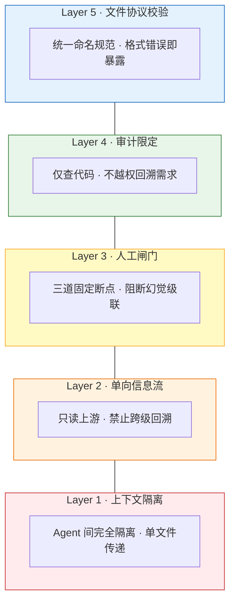

# LingBao-Anti-Hallucination-Pipeline
灵宝 AHP | 七节点中继 Agent 反幻觉工作流
This is the LingBao Anti-Hallucination Pipeline, an original dedicated 7-node relay Agent workflow, built as a deterministic, fully transparent anti-hallucination core framework. It adopts strict one-way information isolation and full traceability mechanism to fundamentally resolve inherent structural LLM hallucination defects, serving as an independent, controllable alternative to AutoGen, LangGraph and MetaGPT.
编程领域抗幻觉Agent工作流，灵宝 AHP 抗幻觉管线 | LingBao Anti-Hallucination Pipeline

这是一套自研的 AI 反幻觉处理管线，通过 7 个核心节点对模型输出进行校验、过滤与修正，提升生成内容的事实性、逻辑性与安全性。

[](https://python.org)
[](LICENSE)
[]()

---

## 核心理念

```
主流 Agent 框架:  共享上下文 + 多 Agent 协作  →  幻觉乘法器
本框架:           严格隔离 + 单向接力 + 人工闸门  →  幻觉阻断器
```

**AutoGen/LangGraph/MetaGPT 的目标是灵活性。本框架的目标是确定性。**

---

## 架构概览

### 7 节点接力管线


> 蓝色 = 需求澄清阶段（三道闸门） · 橙色 = 方案执行阶段 · 绿色 = 审计交付

### 五层纵深防御



---

## 快速开始

### 安装

```bash
pip install lingbao-ahp
```

### 基础用法

```bash
# 运行完整管线
lingbao-ahp run my-project

# 从第 3 步开始，到第 5 步结束
lingbao-ahp run my-project --start-from 3 --stop-at 5

# 从闸门拒绝点恢复
lingbao-ahp resume my-project --step 3

# 查看管线状态
lingbao-ahp status my-project

# 查看全部步骤
lingbao-ahp steps
```

### 接入你的 LLM

框架不带 LLM 后端，需要在 `BaseAgent._execute` 中接入你的 LLM：

```python
from pipeline.agents.base import ConsensusAgent
from pathlib import Path

class MyConsensusAgent(ConsensusAgent):
    def _execute(self, upstream: str, output_file: Path, **kwargs) -> str:
        response = your_llm_client.chat(
            system_prompt="你是一个需求澄清专家...",
            user_prompt=upstream,
        )
        return response
```

---

## 文件协议

所有产出严格遵循统一命名规范：

```
.codebuddy/outputs/{project_id}/
    ├── 01_共识生成_产出.md          # 目标锁定文档
    ├── 02_意图翻译_产出.md          # 确定性需求 Spec
    ├── 03_创新策展_产出.md          # 方案对比表
    ├── 04_架构师_产出.md            # 工程蓝图
    ├── 05_代码实现师_产出.md        # 核心代码
    ├── 06_工程落地师_产出.md        # 工程化项目
    └── 07_代码审计师_产出.md        # 审计报告
```

---

## 与业界方案对比

| 维度 | 灵宝 AHP | AutoGen | LangGraph | MetaGPT |
|---|---|---|---|---|
| 幻觉控制 | ★★★★★ 五层纵深 | ★★ 事件驱动 | ★★★ interrupt | ★★★ SOP |
| 信息流纪律 | 严格单向 | 共享上下文 | 共享 State | 共享上下文 |
| 人工闸门 | 三道固定断点 | 未文档化 | 动态中断 | Agent 对 Agent |
| 工程隔离 | 完全隔离 | 无 | 无 | 无 |
| 协作模式 | 单一接力 | Swarm/Selector/Teams | 有向图/子图 | 装配线 |
| 许可证 | BSL | MIT | Apache 2.0 | MIT |

---

## 许可证

本项目采用 **BSL 1.1 (Business Source License 1.1)** 协议发布：

- **个人学习、研究、测试用途**：可免费使用
- **企业生产环境、商用场景**：需获得正式授权

详见 [LICENSE](LICENSE)

## 联系方式

- **商业合作/授权洽谈**：34395668@qq.com
- **社区反馈/问题建议**：提交 Issues
- **技术来源**：灵宝AI技术开发实验室

---

## 为什么选择灵宝 AHP

1. **幻觉防线最深**：五层纵深防御，业界没有第二家
2. **信息流最纯净**：每节点只读一个上游文件，零交叉污染
3. **可追溯可复现**：固定顺序接力 + 标准化文件协议，输出 100% 可溯源
4. **无黑盒依赖**：不绑定任何 LLM 后端，Agent 逻辑完全透明

---

## 开发

```bash
git clone https://github.com/your-org/lingbao-ahp.git
cd lingbao-ahp
pip install -e ".[dev]"
pytest
```
